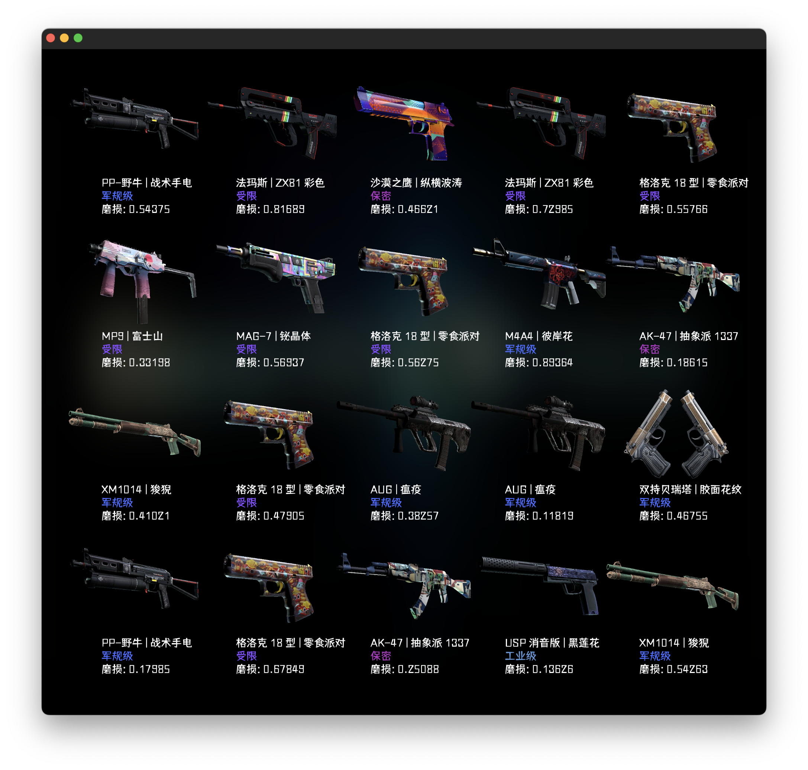

# CSGO-case-simulator-nonebot

## Preview

## Usage
* `/open 数量 箱子` 开箱
* `/cases` 查看箱子
* `/s_search` 搜索皮肤

## How to start

1. generate project using `nb create` .
2. create your plugin using `nb plugin create` .
3. writing your plugins under `src/plugins` folder.
4. run your bot using `nb run --reload` .

## Documentation

See [Docs](https://v2.nonebot.dev/)
