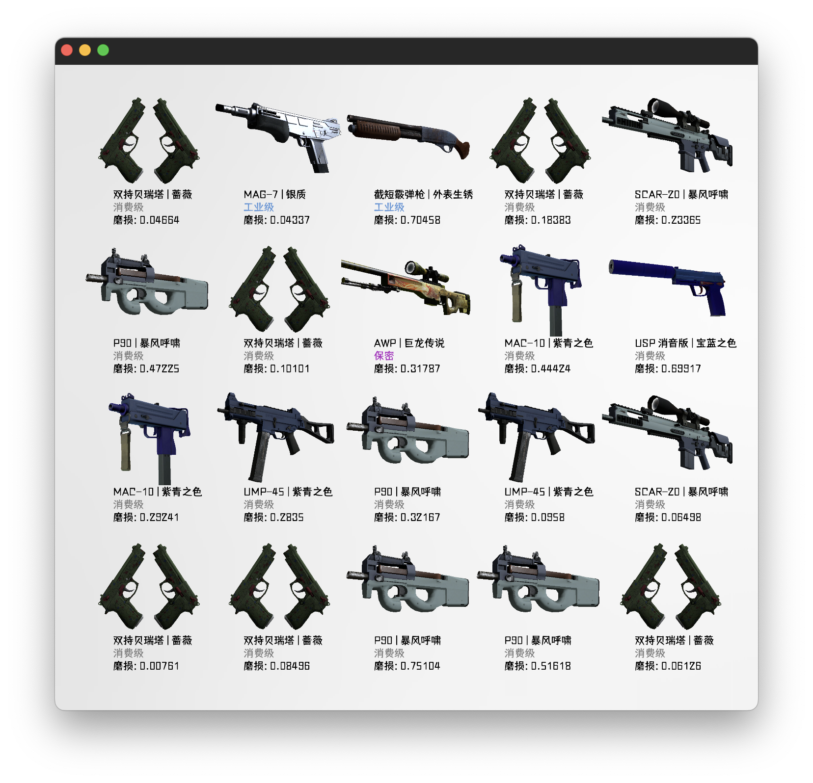

  
   
  

# nonebot-plugin-csgo-case-simulator

_✨ NoneBot的CSGO开箱模拟器 ✨_

## 📖 介绍

这是一个 NoneBot 的 CSGO 开箱模拟器插件，目前已支持的功能有：
* 武器箱
* 纪念包
* 多箱连开（最多20）
* ~~和游戏内完全相同的出货概率~~

## 💿 安装

使用 nb-cli 安装

在 nonebot2 项目的根目录下打开命令行, 输入以下指令即可安装

    nb plugin install nonebot-plugin-csgo-case-simulator

使用包管理器安装

在 nonebot2 项目的插件目录下, 打开命令行, 根据你使用的包管理器, 输入相应的安装命令

pip

    pip install nonebot-plugin-csgo-case-simulator

pdm

    pdm add nonebot-plugin-csgo-case-simulator

poetry

    poetry add nonebot-plugin-csgo-case-simulator

conda

    conda install nonebot-plugin-csgo-case-simulator

打开 nonebot2 项目根目录下的 `pyproject.toml` 文件, 在 `[tool.nonebot]` 部分追加写入

    plugins = ["nonebot-plugin-csgo-case-simulator"]

## 🎉 使用
### 指令表
|        指令        |      别名      | 权限  | 需要@ | 范围  |      说明      |
| :----------------: | :------------: | :---: | :---: | :---: | :------------: |
| open [数量] [名称] |    csgo开箱    | 群员  |  否   | 群聊  |   开启武器箱   |
|       cases        | csgo武器箱列表 | 群员  |  否   | 群聊  | 查看所有武器箱 |
|        svs         | csgo纪念包列表 | 群员  |  否   | 群聊  | 查看所有纪念包 |
|  s_skins [皮肤名]  |  csgo皮肤搜索  | 群员  |  否   | 群聊  |    搜索皮肤    |

### 环境变量
|    变量名     | 类型  | 默认值 |       说明       |
| :-----------: | :---: | :----: | :--------------: |
| CSGO_USER_CD  |  int  |   0    | 用户开箱冷却时间 |
| CSGO_GROUP_CD |  int  |   0    |  群开箱冷却时间  |

### 效果图

